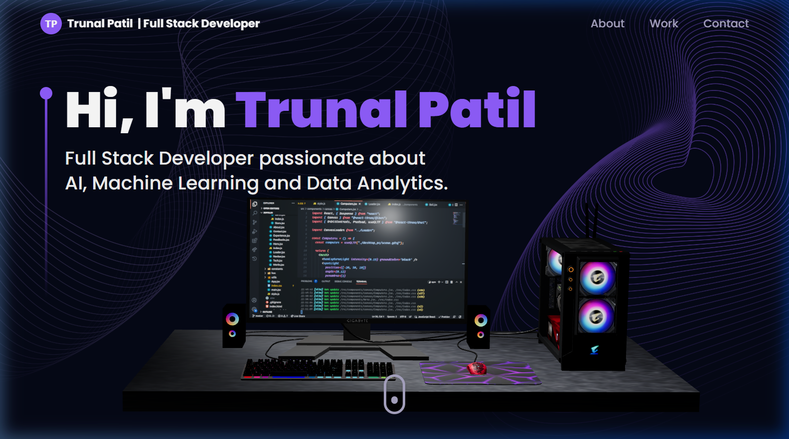

# 3D Developer Portfolio

Welcome to my interactive 3D Developer Portfolio! This modern web application is designed to showcase my skills, experience, and projects as a Full Stack Developer passionate about AI, Machine Learning, and Data Analytics.



## 🌟 Features

- **Interactive 3D Elements:** Engaging 3D models and animations powered by Three.js and React Three Fiber, including a custom developer desk setup and a rotating Earth model.
- **Responsive Design:** Fully responsive layout that ensures a seamless experience across desktop, tablet, and mobile devices.
- **Dynamic Animations:** Smooth page transitions and scroll animations implemented with Framer Motion.
- **Modern Tech Stack:** Built with the latest tools including React, Vite, and Tailwind CSS for rapid development and optimized performance.
- **Showcase Sections:**
  - **About:** A brief overview of my background and expertise.
  - **Experience:** An interactive timeline detailing my professional journey and startup experience.
  - **Technologies:** A visually striking display of my core skills using rotating 3D badge icons.
  - **Projects:** Detailed project cards with live links and GitHub repository access.
  - **Contact:** A functional contact form integrated with EmailJS.

## 🛠️ Technologies Used

- **Frontend Framework:** React.js
- **Build Tool:** Vite
- **Styling:** Tailwind CSS
- **3D Graphics:** Three.js, React Three Fiber, React Three Drei
- **Animations:** Framer Motion
- **Routing:** React Router DOM
- **Email Integration:** EmailJS

## 🚀 Getting Started

To run this project locally, follow these steps:

### Prerequisites

Ensure you have [Node.js](https://nodejs.org/) installed on your machine.

### Installation

1.  Clone the repository:
    ```bash
    git clone https://github.com/Trunal2005/My-Portfolio.git
    ```
2.  Navigate to the project directory:
    ```bash
    cd My-Portfolio
    ```
3.  Install the dependencies:
    ```bash
    npm install
    # or
    yarn install
    ```

### Running the Development Server

Start the Vite development server:

```bash
npm run dev
# or
yarn dev
```

The application will be available at `http://localhost:5173`.

## 🌐 Live Demo

_(Add link to live deployment here once hosted)_

## 📄 License

This project is open-source and available under the [MIT License](LICENSE).

---

_Built with ❤️ by Trunal Patil_

## Git Version Control Practice

This portfolio project is maintained using Git and GitHub for version control.